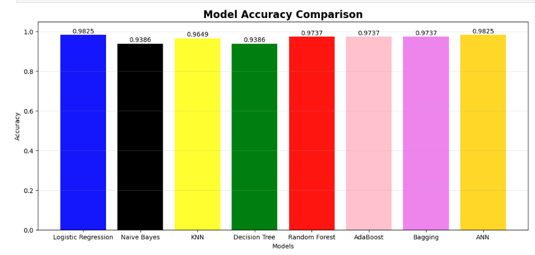
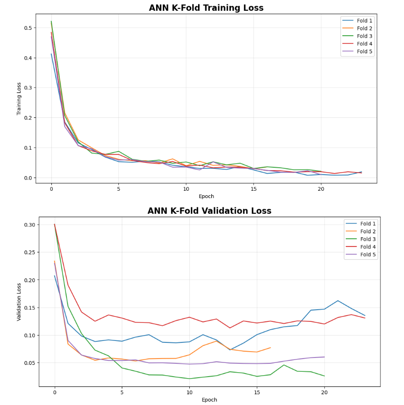
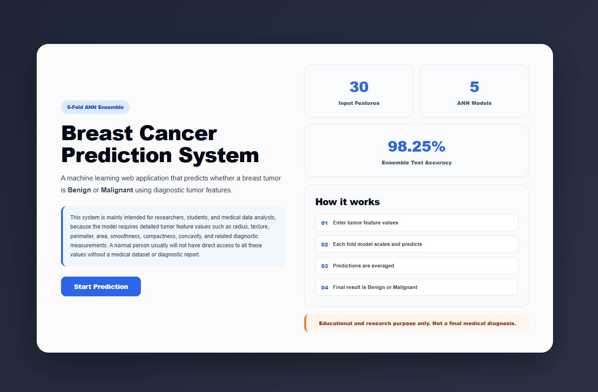
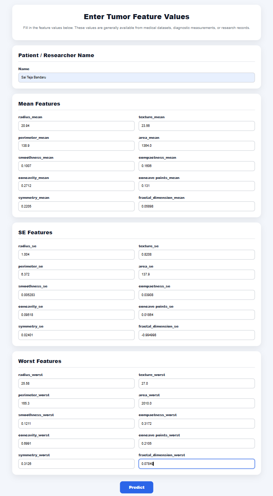
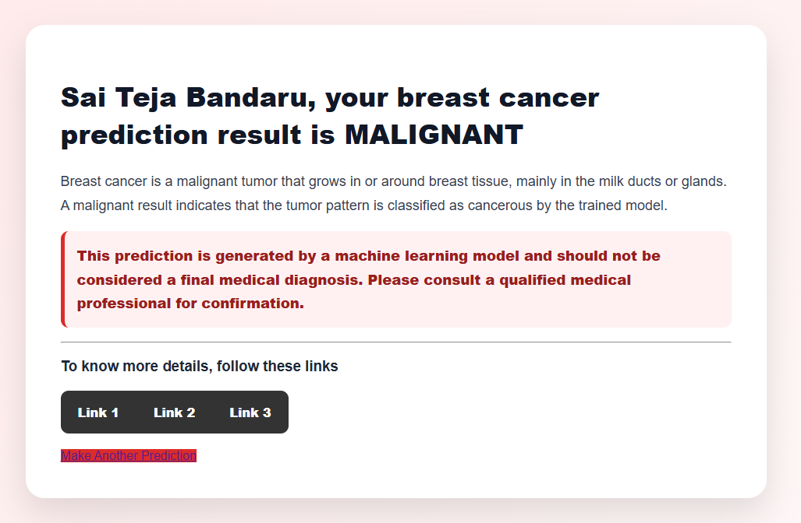

# Breast Cancer Classification using Optimized ML Models and ANN 5-Fold Ensemble

A Flask-based breast cancer prediction application that classifies tumors as **Benign** or **Malignant** using the Breast Cancer Wisconsin Diagnostic dataset.

This project compares multiple hyperparameter-optimized machine learning models and then deploys a final **Artificial Neural Network 5-fold ensemble model** through a clean web interface.

---

## How to Run Locally

### 1. Clone the repository

```bash
git clone https://github.com/saitejabandaru/Breast_Cancer_Classification_using_5fold_ANN.git
cd Breast_Cancer_Classification_using_5fold_ANN
```

### 2. Create and activate virtual environment

```bash
python -m venv venv
```

For Windows:

```bash
venv\Scripts\activate
```

For macOS/Linux:

```bash
source venv/bin/activate
```

### 3. Install dependencies

```bash
pip install -r requirements.txt
```

### 4. Run the Flask app

```bash
python app.py
```

Open in browser:

```
http://127.0.0.1:5000/
```

---

## Project Overview

The goal of this project is to predict whether a breast tumor is **Benign** or **Malignant** using 30 diagnostic tumor features.

The workflow includes:

* Data preprocessing and cleaning
* Stratified train-test split
* Hyperparameter optimization for ML models
* Model comparison using test accuracy
* ANN training using 5-fold cross-validation
* Ensemble prediction using all fold models
* Flask deployment

---

## Dataset

The dataset contains 30 diagnostic tumor features such as:

* Radius
* Texture
* Perimeter
* Area
* Smoothness
* Compactness
* Concavity
* Symmetry
* Fractal dimension

Target encoding:

```python
M = 1  # Malignant
B = 0  # Benign
```

---

## Machine Learning Models

Models implemented:

* Logistic Regression
* Naive Bayes
* KNN
* Decision Tree
* Random Forest
* AdaBoost
* Bagging

Hyperparameter tuning was performed using **GridSearchCV (5-fold CV)**.

---

## Model Accuracy Comparison



| Model               | Accuracy |
| ------------------- | -------- |
| Logistic Regression | 98.25%   |
| Naive Bayes         | 93.86%   |
| KNN                 | 96.49%   |
| Decision Tree       | 93.86%   |
| Random Forest       | 97.37%   |
| AdaBoost            | 97.37%   |
| Bagging             | 97.37%   |
| ANN Ensemble        | 98.25%   |

---

## ANN 5-Fold Cross Validation

The ANN was trained using **Stratified 5-Fold Cross-Validation**.

Each fold:

1. Fits scaler on training fold
2. Trains ANN model
3. Validates on validation fold
4. Saves model and scaler

---

## Ensemble Prediction

Final prediction uses all 5 models:

```
Input → 5 Scalers → 5 ANN Models → Average Predictions → Final Class
```

Final ANN Ensemble Accuracy:

```
98.25%
```

---

## ANN Training and Validation Loss



* Training loss decreases → model learns patterns
* Validation loss monitors generalization
* Early stopping prevents overfitting

---

## Flask Web Application

### Home Page



### Prediction Page



### Result Page



---

## Project Structure

```
Breast_Cancer_Classification/
│
├── app.py
├── requirements.txt
├── README.md
├── data.csv
├── notebook.ipynb
│
├── fold_models/
├── templates/
├── static/
└── images/
```

---

## Tech Stack

* Python
* Scikit-learn
* TensorFlow / Keras
* Flask
* HTML / CSS

---

## Key Highlights

* Hyperparameter optimization using GridSearchCV
* Comparison of multiple ML models
* ANN with dropout and early stopping
* 5-fold cross validation
* Ensemble learning for final prediction
* Flask deployment

---

## Disclaimer

This project is for educational and research purposes only and should not be used for medical diagnosis.
